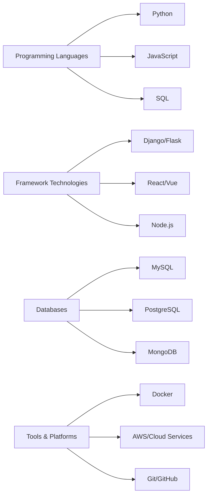

# About

## About This Site

Welcome to my tech blog! This is where I share programming experiences, technical insights, and learning notes.

### Purpose

As a developer, I deeply understand the importance of technical learning and sharing. The purpose of creating this blog is to:

- 📝 **Document Learning Process**: Organize learned knowledge into documents to deepen understanding
- 🤝 **Share Technical Experience**: Help other developers avoid pitfalls and improve development efficiency
- 💡 **Explore Tech Trends**: Focus on new technology developments and maintain technical sensitivity
- 🌱 **Continuous Growth**: Continuously improve technical skills through writing and sharing

### Tech Stack

This blog is built using the following technologies:

=== "Documentation Generation"
    - **MkDocs**: Static site generator
    - **Material for MkDocs**: Modern theme
    - **Markdown**: Content writing format

=== "Deployment & Hosting"
    - **GitHub Pages**: Static website hosting
    - **GitHub Actions**: Automated deployment
    - **Git**: Version control

=== "Development Tools"
    - **Python**: Runtime environment
    - **VS Code**: Code editor
    - **Git**: Version management

## About the Author

### Skill Areas

### Areas of Interest

!!! info "Technical Interests"
    - **Web Development**: Full-stack development, focusing on user experience and performance optimization
    - **Data Science**: Data analysis, machine learning applications
    - **Cloud Computing**: Containerized deployment, microservices architecture
    - **Open Source Projects**: Actively participate in open source community, contribute code

### Learning Philosophy

> "Stay hungry, stay foolish." - Steve Jobs

I believe:

- 🎯 **Continuous Learning**: Technology is changing rapidly, maintaining learning enthusiasm is key
- 🔍 **Deep Understanding**: Not only know how to do it, but also understand why
- 🤝 **Willing to Share**: Knowledge increases in value through sharing, helping others is helping yourself
- 💪 **Practice is King**: Combine theory with practice, validate and apply knowledge in projects

## Contact

If you have questions about the articles or want to discuss technical topics, feel free to contact me:

### Social Media

- 📧 **Email**: [your.email@example.com](mailto:your.email@example.com)
- 🐙 **GitHub**: [@yourusername](https://github.com/yourusername)
- 🐦 **Twitter**: [@yourusername](https://twitter.com/yourusername)
- 💼 **LinkedIn**: [Your Name](https://linkedin.com/in/yourprofile)

### Technical Communication

- 💬 **WeChat**: Please mention the source when adding
- 📱 **QQ Group**: Technical discussion group (Group ID: 123456789)
- 🎮 **Discord**: Join our technical discussion server

## Copyright Notice

### Content License

All original content on this site is licensed under [CC BY-SA 4.0](https://creativecommons.org/licenses/by-sa/4.0/), you can:

- ✅ **Share**: Copy and redistribute the material in any medium or format
- ✅ **Adapt**: Remix, transform, and build upon the material
- ✅ **Commercial Use**: Use the material for commercial purposes

But you must follow these conditions:

- 📝 **Attribution**: You must give appropriate credit and provide a link to the license
- 🔄 **ShareAlike**: If you remix, transform, or build upon the material, you must distribute your contributions under the same license

### Disclaimer

- The content of this site is for learning and reference only, and does not constitute any form of technical advice
- When using code examples from this site, please adjust and test according to actual conditions
- This site is not responsible for any losses caused by using the content of this site

---

*Thank you for visiting, I hope this blog can be helpful to you!*

    

        <strong>Built with ❤️ using MkDocs and Material Theme</strong>
    

    

        <em>Last updated: 2024</em>
    

