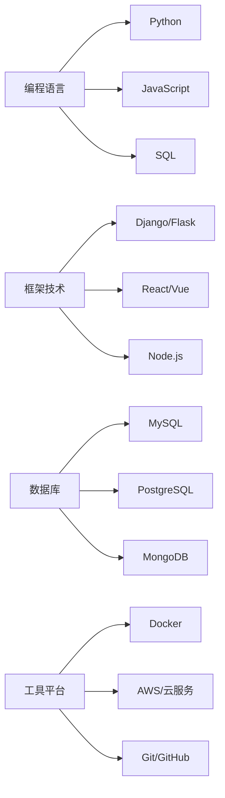

# 关于

## 关于本站

欢迎来到我的技术博客！这里是我分享编程经验、技术心得和学习笔记的地方。

### 建站初衷

作为一名开发者，我深知技术学习和分享的重要性。创建这个博客的目的是：

- 📝 **记录学习过程**：将学习到的知识整理成文档，加深理解
- 🤝 **分享技术经验**：帮助其他开发者避免踩坑，提高开发效率
- 💡 **探讨技术趋势**：关注新技术发展，保持技术敏感度
- 🌱 **持续成长**：通过写作和分享，不断提升自己的技术水平

### 技术栈

本博客使用以下技术构建：

=== "文档生成"
    - **MkDocs**: 静态站点生成器
    - **Material for MkDocs**: 现代化主题
    - **Markdown**: 内容编写格式

=== "部署托管"
    - **GitHub Pages**: 静态网站托管
    - **GitHub Actions**: 自动化部署
    - **Git**: 版本控制

=== "开发工具"
    - **Python**: 运行环境
    - **VS Code**: 代码编辑器
    - **Git**: 版本管理

## 关于作者

### 技能领域

### 兴趣方向

!!! info "技术兴趣"
    - **Web 开发**: 全栈开发，关注用户体验和性能优化
    - **数据科学**: 数据分析、机器学习应用
    - **云计算**: 容器化部署、微服务架构
    - **开源项目**: 积极参与开源社区，贡献代码

### 学习理念

> "Stay hungry, stay foolish." - Steve Jobs

我相信：

- 🎯 **持续学习**：技术日新月异，保持学习热情是关键
- 🔍 **深入理解**：不仅要知道怎么做，更要理解为什么这样做
- 🤝 **乐于分享**：知识因分享而增值，帮助他人也是帮助自己
- 💪 **实践为王**：理论结合实践，在项目中验证和应用知识

## 联系方式

如果您对文章内容有疑问，或者想要交流技术话题，欢迎通过以下方式联系我：

### 社交媒体

- 📧 **Email**: [your.email@example.com](mailto:your.email@example.com)
- 🐙 **GitHub**: [@yourusername](https://github.com/yourusername)
- 🐦 **Twitter**: [@yourusername](https://twitter.com/yourusername)
- 💼 **LinkedIn**: [Your Name](https://linkedin.com/in/yourprofile)

### 技术交流

- 💬 **微信**: 添加时请注明来源
- 📱 **QQ群**: 技术交流群（群号：123456789）
- 🎮 **Discord**: 加入我们的技术讨论服务器

## 版权声明

### 内容许可

本站所有原创内容采用 [CC BY-SA 4.0](https://creativecommons.org/licenses/by-sa/4.0/) 许可协议，您可以：

- ✅ **分享**：在任何媒介以任何形式复制、发行本作品
- ✅ **演绎**：修改、转换或以本作品为基础进行创作
- ✅ **商业使用**：在商业环境中使用本作品

但需要遵守以下条件：

- 📝 **署名**：必须给出适当的署名，提供指向本许可协议的链接
- 🔄 **相同方式共享**：如果您修改、转换或以本作品为基础进行创作，您必须基于与原先许可协议相同的许可协议分发您贡献的作品

### 免责声明

- 本站内容仅供学习和参考，不构成任何形式的技术建议
- 使用本站代码示例时，请根据实际情况进行调整和测试
- 对于因使用本站内容而造成的任何损失，本站不承担责任

---

*感谢您的访问，希望这个博客能对您有所帮助！*

    

        <strong>Built with ❤️ using MkDocs and Material Theme</strong>
    

    

        <em>最后更新：2024年</em>
    

