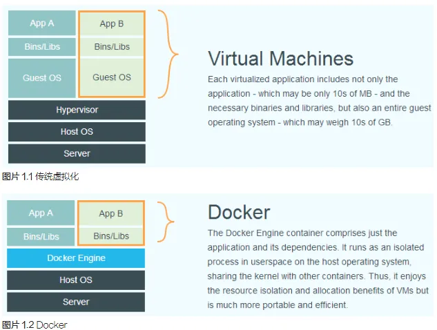
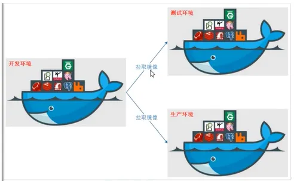
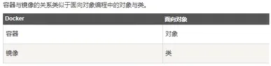

# Docker
<!-- header -->
!!! info 
    XXXXD
---
# Docker 技术文章
### 1 什么是docker&docker的历史背景

!!! info 
    1. docker 一个开源的应用容器引擎，基于 Go 语言，并遵从 Apache2.0 协议开源。
    docker 项目目标是实现轻量级的操作系统虚拟化解决方案。
    docker 基础是 linux 容器（LXC）等技术，在 LXC 基础 docker 进行进一步的封装，不需要关心容器的管理。使得用户操作 docker 的容器就如操作一个快速轻量级的虚拟机一样。
    容器是在操作系统层面上实现了虚拟化，直接复用本地主机的操作系统；传统方式则直接在硬件层面进行实现。
    
    2.  优势  
        - docker 容器启动快
        - 应用性能高，系统开销小
    docker：对应用组件进行封装，分发，部署，运行等生命周期进行管理，使用户 APP 及其运行环境能做到“一次镜像，处处运行”。
    
    传统虚拟机，首先虚拟出一条硬件，运行一个完整的的操作系统，然后在这个系统上安装和运行软件；docker 容器内的应用直接运行在宿主机上，容器无自己的内核，也没有虚拟硬件，所以更加轻便和轻巧。
    
    容器与镜像的关系，同对象和类的关系一样。docker 镜像文件类似于 Java 类模板，docker 容器实例类似于 java 中 new 出来的对象。
    仓库，集中存放镜像的地方。
    
### 2 docker和wsl的区别

**概念与架构**

Docker

+ Docker 是一个开源的容器化平台，它允许开发者将应用程序及其依赖项打包成一个称为容器的标准化单元。
+ 采用客户端 - 服务器（C/S）架构。Docker 守护进程（dockerd）运行在主机操作系统上，负责管理容器的创建、运行、停止等操作。用户通过 Docker 客户端与守护进程交互。
+ 容器是在操作系统层面上的虚拟化，多个容器可以共享主机操作系统内核，通过内核的命名空间（namespaces）和控制组（cgroups）等技术实现资源隔离和限制。

WSL

+ WSL 是 Windows 下的一个子系统，它允许在 Windows 操作系统上原生运行 Linux 二进制可执行文件。
+ 在架构上，WSL 是 Windows 和 Linux 系统之间的一个兼容层。它包含了一个 Linux 内核兼容层，能够将 Linux 系统调用转换为 Windows 系统调用，从而使 Linux 程序可以在 Windows 上运行。

<h4 id="XIPFu">**二者应用场景分析**</h4>
Docker

+ 主要用于应用程序的打包、分发和部署。开发人员可以将应用程序及其依赖（如运行时环境、库等）打包成一个容器，然后在任何支持 Docker 的环境中运行，确保了应用在不同环境下的一致性。
+ 广泛应用于持续集成 / 持续交付（CI/CD）流水线中，方便构建、测试和部署应用。例如，在一个软件开发项目中，开发人员可以在本地使用 Docker 构建和测试应用，然后将容器镜像推送到生产环境中运行。
+ 对于微服务架构，Docker 可以轻松地部署和管理各个微服务，每个微服务可以运行在自己的容器中，容器之间通过网络进行通信。

WSL

+ 为 Windows 用户提供了一个在 Windows 系统中使用 Linux 命令行工具和运行 Linux 应用程序的便捷方式。对于需要同时使用 Windows 和 Linux 工具的开发者，如 Web 开发人员可能需要在 Windows 上使用文本编辑器、数据库管理工具等，同时在 Linux 环境下使用构建工具（如 make、gcc 等）和运行服务器（如 Node.js、Ruby on Rails 等）。
+ 适合于学习和探索 Linux 系统。对于初学者来说，可以在熟悉的 Windows 环境下学习 Linux 命令、操作文件系统、安装和使用 Linux 软件等。

<h4 id="Nr1Q1">**二者资源管理说明**</h4>
Docker

+ 可以精确地控制容器的资源使用，如 CPU、内存、磁盘 I/O 等。通过设置容器的资源限制，可以确保一个容器不会过度占用主机资源，从而影响其他容器或主机上的其他应用程序。
+ Docker 容器共享主机操作系统内核，相比于传统虚拟机，容器的资源开销更小。例如，启动一个 Docker 容器通常只需要几秒钟，并且占用的磁盘空间也相对较小，因为容器只包含应用程序及其依赖，而不是整个操作系统。

WSL

+ 在 WSL 2 中，每个 WSL 实例都有自己的虚拟内存和磁盘空间分配。WSL 2 使用了轻量级的虚拟机来运行 Linux 内核，因此在资源管理上相对独立，但与 Docker 容器相比，其资源分配方式更类似于虚拟机。
+ 由于 WSL 是在 Windows 系统之上运行 Linux 环境，它的资源使用受到 Windows 系统的总体资源限制和分配策略的影响。例如，如果 Windows 系统本身的内存不足，WSL 中的 Linux 应用可能会受到性能影响。

<h4 id="kO8vK">**二者安全性考虑**</h4>
Docker

+ Docker 通过内核的命名空间和控制组技术提供了一定程度的安全隔离。命名空间可以隔离容器的进程、网络、文件系统等资源，使得容器之间相互独立。控制组可以限制容器对资源的使用，防止某个容器过度消耗资源。
+ 由于容器共享主机内核，如果内核存在漏洞，可能会影响到所有容器。因此，保持主机操作系统内核的安全更新至关重要。此外，Docker 也提供了一些安全机制，如内容信任（Content Trust）来确保镜像的完整性和来源可靠性。

WSL

+ WSL 通过 Windows 和 Linux 之间的安全转换层来确保安全性。在 WSL 中，Linux 系统调用被转换为 Windows 系统调用，Windows 的安全机制（如用户账户控制、防火墙等）也对 WSL 有一定的保护作用。
+ 由于 WSL 是在 Windows 环境下运行 Linux，存在一些跨系统的安全考虑，例如，在 WSL 和 Windows 之间共享文件时可能存在权限和安全风险，需要谨慎管理共享目录的访问权限。

:::

<h3 id="cUXXZ"><font style="color:rgb(23, 43, 77);">3 如何理解docker中镜像、容器</font></h3>


:::tips
**镜像**

1. <font style="color:#2A4200;">从仓库获取镜像</font>

`docker pull`：进行镜像的拉取

`docker images -a`：显示本地已有的镜像

创建镜像：docker hub 获取已有镜像并更新或者本地文件系统进行创建 dockerfile 来创建镜像。

dockerfile 创建镜像：使用`#`注释，FROM 指令告诉 docker 使用哪个镜像作为基础，维护者的信息，RUN 开头的指令会在创建中运行。编写完成使用 docker build 生成镜像。

`docker push`：将创建镜像上传到仓库中。

`docker save`：导出镜像到本地文件。

`docker load`：将镜像从本地文件导入到本地镜像库

`docker rmi hello-word:latest`：删除镜像，得加上当前的 Tag/或者使用 image id 来进行时删除，在删除镜像的时候要查看一下该容器有没有被其他容器所绑定，有的话先把绑定的容器给删除再删除镜像。

`docker rm`：移除容器，在删除经前之前使用该命令将依赖于该镜像的所有容器进行删除掉。

2. <font style="color:#2A4200;">管理本地主机上的镜像</font>
+ **查看镜像**
    - `docker images`：可以列出本地主机上所有的镜像。该命令会显示镜像的.repository（镜像名称）、tag（标签）、image id（镜像 ID）、created（创建时间）以及 size（大小）等信息。
+ **搜索镜像**
    - `docker search <镜像名称>`：可以在 Docker Hub 上搜索特定的镜像。例如，`docker search ubuntu`可以搜索与 Ubuntu 相关的镜像。搜索结果会显示镜像名称、描述、星级评分、是否官方镜像以及下载次数等信息，帮助你选择合适的镜像。
+ **拉取镜像**
    - `docker pull <镜像名称>:<标签>`：从 Docker 镜像仓库（如 Docker Hub）拉取镜像到本地主机。如果不指定标签，则会拉取最新的标签（通常为 latest）。例如，`docker pull ubuntu:20.04`会拉取 Ubuntu 20.04 版本的镜像。
+ **删除镜像**
    - `docker rmi <镜像 ID> 或 <镜像名称>:<标签>`：可以删除本地主机上的一个或多个镜像。在删除镜像之前，确保没有容器正在使用该镜像。如果有容器正在使用该镜像，可以先停止并删除容器，然后再删除镜像。
+ **保存和加载镜像**
    - `docker save -o <保存的文件名> <镜像名称>:<标签>`：可以将指定的镜像保存为一个压缩文件。这个文件可以在其他地方进行传输或备份。
    - `docker load -i <保存的文件名>`：可以从保存的压缩文件中加载镜像到本地主机。
+ **重命名和打标签**
    - `docker tag <旧镜像名称>:<旧标签> <新镜像名称>:<新标签>`：可以为镜像重新命名和打标签。这在需要对镜像进行自定义命名或指定特定版本时非常有用。
3. <font style="color:#2A4200;">镜像实现的基本原理</font>

<font style="color:#213BC0;background-color:#FFFFFF;">分层存储与镜像构建原理（要点 6 说明）。</font>

<font style="color:#213BC0;background-color:#FFFFFF;">分层存储：docker 镜像是由一系列分层存储构成，每一层代表一个文件系统的快照，每个镜像层为可读，当容器运行时候会在镜像层上面添加一个可写层来用于容器的写操作，如此多个容器可共享一个只读的镜像层而拥有自己只写的可写层，由此实现资源的共享和隔离。</font>

+ <font style="color:#213BC0;background-color:#FFFFFF;">分层存储使得多个镜像共享一样的基础层，只需要存储一份基础层就可以供所有的使用，降低存储要求（镜像复用）</font>
+ <font style="color:#213BC0;background-color:#FFFFFF;">镜像分层存储结构只传输更改的的层，而非整个镜像，所以传输只需要传输更新的部分，减小传输量，提高传输效率（镜像传输效率）</font>
+ <font style="color:#213BC0;background-color:#FFFFFF;">每个镜像只读，当更新或修改镜像，只需要新增一层来覆盖原有的层，实现镜像版本的管理（镜像版本管理）</font>

<font style="color:#213BC0;background-color:#FFFFFF;">例如，假设有两个镜像A和B，它们都使用了相同的基础镜像C作为底层。在存储中，镜像A和B分别保存自己的特定层以及指向镜像C的指针。实际上，镜像C的内容在存储中只保存一份，但由于镜像A和B都依赖于这份内容，它们共享了同一个基础层，从而节省了存储空间。</font>

docker 如何实现增量的修改和维护？

每个镜像都由很多层次构成，docker 使用 Uninon FS 将这些不同的层结合到一个镜像中去。Uninon FS ，一是可实现不借助 LVM、RAID 将多个 disk 挂到同一个目录下，二是将一个只读的分支和一个可写的分支联合在一起，Live CD 正是基于此方法允许在镜像不变的基础上允许用户在其上进行一些写操作。 

Docker 在 AUFS 上构建的容器也是利用了类似的原理。  

**Union FS（联合文件系统）**

    - 这是一种分层的、轻量级的文件系统。它可以将多个不同位置（例如不同的磁盘分区或者文件目录）的文件系统挂载到同一个挂载点上，使得这些文件系统看起来就像一个单一的文件系统。它的特点在于能够合并不同文件系统的内容，提供一种灵活的文件管理方式。

**LVM（Logical Volume Manager，逻辑卷管理器）**

    - LVM 是一种在 Linux 系统中用于对磁盘分区进行管理的技术。它允许管理员在不重新分区磁盘或中断系统运行的情况下，动态调整磁盘分区的大小。通过将物理磁盘或分区组合成卷组（Volume Group），然后从卷组中创建逻辑卷（Logical Volume），可以更灵活地分配磁盘空间，方便磁盘的管理和扩展。

**RAID（Redundant Array of Independent Disks，独立磁盘冗余阵列）**

    - RAID 是一种将多个独立的磁盘组合成一个逻辑磁盘的技术。主要目的是提高磁盘存储的性能、可靠性或两者兼具。不同的 RAID 级别（如 RAID 0、RAID 1、RAID 5 等）提供不同的性能和数据冗余特性。例如，RAID 0 通过条带化提高磁盘读写速度，RAID 1 通过镜像提供数据冗余等。

**Live CD**

    - Live CD 是一种可以直接从光盘（CD - ROM）启动计算机的光盘，它包含一个完整的可运行的操作系统环境。用户不需要将操作系统安装到硬盘上就可以使用。这种方式方便用户在不改变计算机现有硬盘数据和系统设置的情况下，体验不同的操作系统或者进行系统维护、故障排除等操作。

**Docker**

    - Docker 是一个开源的容器化平台。它允许开发者将应用程序及其依赖项打包到一个可移植的容器中。容器在不同的环境（如开发、测试、生产环境）之间提供了一致的运行环境，使得应用程序可以快速、可靠地部署。Docker 利用容器技术在隔离的环境中运行多个应用程序实例，提高了资源利用率和应用程序的可移植性。

**AUFS（Another UnionFS，另一种联合文件系统）**

    - AUFS 是一种联合文件系统的实现。它在 Docker 中被用于构建容器。AUFS 通过分层的方式管理文件系统，允许容器共享基础镜像（只读层），同时每个容器可以有自己的可写层。这种分层结构提高了容器镜像的存储效率和分发速度，并且便于容器的创建和管理。


**容器**

容器是独立运行的一个或一组应用，以及他们的运行态环境。

启动容器：① 基于镜像新建容器进行启动 ② 将在终止状态（stopped）的容器重新启动。

1. 新建容器并启动--`docker run`


上面命令输出一个 hello-world 之后就终止容器。

`docker run` 创建终端：

① 检查本地是否存在指定的镜像，不存在就从公有仓库下载 

② 利用镜像创建并启动一个容器 

③ 分配一个文件系统，并在只读的镜像层外面挂载一层可读写层

④ 从宿主主机配置的网桥接口中桥接一个虚拟接口到容器中去

⑤ 从地址池配置一个 ip 地址给容器

⑥ 执行用户指定的应用程序

⑦ 执行完毕后容器被终止

2. 容器核心是所执行的应用程序所需要的资源，这些资源都是应用程序运行所必需的，`ps `或 `top` 查看进程信息。


查看进程，只运行了指定的 bash 应用，使得 docker 对资源的应用率极高。

启动已终止容器--`docker start`

3. `-d`参数让 docker 容器在后台以守护态形式进行


`docker ps`：查看容器信息

`docker logs`：查看容器的输出信息

4.  Docker容器中指定的应用终结时，容器也自动终止 。

`docker ps -a`：查看终止状态的容器

`docker stop`：终止一个运行中的容器

`docker start`：启动处于终止状态的容器

`docker restart`：将一个运行态的容器终止然后再重新启动它

5. 进入容器，容器启动后进入后台，某些时候就得进入其中进行一些操作

`docker attach` 或` nsenter `工具

6. 导出容器

`docker export`：导出本地某个容器

`docker import`：从容器快照文件中再导入为镜像

7. 删除容器

`docker rm`：删除一个终止状态的容器，`docker rm -f`， 加上`-f `参数删除一个运行中的容器，docker 会发送` SIGKILL` 信号给容器。

:::

:::tips
**仓库**

集中存放镜像的地方。

`docker search`

`docker pull`

`docker push`

:::

<h3 id="TCOe1"><font style="color:rgb(23, 43, 77);">4 安装vmware和安装ubuntu虚拟机</font></h3>
VMWare 16pro

ubantu22.04

<h3 id="FZk6I"><font style="color:rgb(23, 43, 77);">5 在ubuntu下安装docker</font></h3>
**Step 1: Uninstall Old Versions**

First, remove any old versions of Docker:

`sudo apt-get remove docker docker-engine docker.io containerd runc`

**Step 2: Update Software Packages**

Update your existing list of packages:

`sudo apt-get update`

`sudo apt-get upgrade`

**Step 3: Install Dependencies**

Install necessary packages for Docker:

`sudo apt-get install ca-certificates curl gnupg lsb-release`

**Step 4: Add Docker’s Official GPG Key**

Add Docker's official GPG key:

`curl -fsSL http://mirrors.aliyun.com/docker-ce/linux/ubuntu/gpg | sudo apt-key add -`

**Step 5: Set Up the Docker Repository**

Add the Docker repository to APT sources:

`sudo add-apt-repository "deb [arch=amd64] http://mirrors.aliyun.com/docker-ce/linux/ubuntu $(lsb_release -cs) stable"`

**Step 6: Install Docker Engine**

Install the latest version of Docker Engine and containerd:

`sudo apt-get install docker-ce docker-ce-cli containerd.io`

**Step 7: Manage Docker as a Non-Root User (Optional)**

Add your user to the _docker_ group to run Docker commands without _sudo_:

`sudo usermod -aG docker $USER`

`newgrp docker`

**Step 8: Start and Enable Docker Service**

Start and enable the Docker service:

`sudo systemctl start docker`

`sudo systemctl enable docker`

**Step 9: Verify Installation**

Run the following command to verify that Docker is installed correctly:

`sudo docker run hello-world`

:::warning
到**Step 6: Install Docker Engine** 未通（containerd.io）：

1. 依赖：`sudo apt install apt-transport-https ca-certificates curl software-properties-common gnupg lsb-release`
2. key：`curl -fsSL [https://download.docker.com/linux/ubuntu/gpg](https://download.docker.com/linux/ubuntu/gpg) | sudo gpg --dearmor -o /usr/share/keyrings/docker-archive-keyring.gpg`
3. `sudo apt update`/ `sudo apt-get update`
4. `sudo apt install docker-ce docker-ce-cli containerd.io`

:::

在安装过程中，在创建 daemon.json 的时候，因为对于格式问题会比较的严格，所以文件中格式不太正确的时候，就一直报出如下的错误。

那其实是因为 daemon.json 文件内容格式问题。还原事故现场，以便更好的追溯错误源头。

<h3 id="Mq3g6"><font style="color:rgb(23, 43, 77);">6 Dockerfile怎么写</font></h3>
四部分组成：基础镜像信息，维护者信息，镜像操作指令，容器启动时执行指令。


<h4 id="umkhW">基本步骤</h4>
:::tips
<font style="color:#213BC0;background-color:#FFFFFF;">Dockerfile 一个纯文本文件，每条指令都对应着镜像构建的一个步骤。编写一个基本的 Dockerfile 文件包括以下几个步骤：</font>

+ <font style="color:#213BC0;background-color:#FFFFFF;">选择基础镜像：FROM 指令选择一个基础镜像作为构建起点，基于该镜像进行扩展和定制</font>
+ <font style="color:#213BC0;background-color:#FFFFFF;">添加文件和目录：ADD/COPY 指令将应用的代码、依赖文件等添加到镜像中。这些文件将被复制到镜像的指定目录下，进而构建出应用所需的文件结构。</font>
+ <font style="color:#213BC0;background-color:#FFFFFF;">设置工作目录：WORKDIR 指令设置容器中的工作目录。后续的命令将在该目录之下执行，使后续操作更加简洁和清晰</font>
+ <font style="color:#213BC0;background-color:#FFFFFF;">运行命令：RUN 指令在容器中运行命令，如安装软件包，配置 环境等。一个 RUN 指令就会生成一个新的镜像层</font>
+ <font style="color:#213BC0;background-color:#FFFFFF;">设置环境变量：ENV 指令设置容器中的环境变量，这些变量会在容器运行时被应用程序使用</font>
+ <font style="color:#213BC0;background-color:#FFFFFF;">暴露端口：EXPOSE 指令声明容器运行时监听的端口，但并非将端口暴露给外部网络。也要实现端口映射，就得在容器运行时使用 -p 参数进行配置</font>
+ <font style="color:#213BC0;background-color:#FFFFFF;">容器启动时运行的命令：CMD/ENTRYPOINT 指令何止容器启动时要运行的默认命令或应用。文件末尾且只出现一次</font>

:::

<h4 id="aNq4i">实际例子</h4>
<font style="background-color:#FFFFFF;">例子：使用 nginx 服务器显示一个静态的 html 文件。</font>

1. 编写 Dockerfile 文件

```shell
# 使用nginx作为服务器将一个静态的网页展示出来
# 在构建镜像时，我们需要选择一个基础镜像作为起点。
#由于我们要构建一个 Nginx 服务器
#因此我们选择一个官方提供的 Nginx 基础镜像。
FROM nginx:latest
# 将网页文件复制到镜像中的合适位置
#在容器中展示一个静态网页，我们需要将网页文件
# 复制到镜像中的合适目录。在本例中，我们假设静态网页文件 
# css.html 存放在当前目录下的 webpage 文件夹中
COPY webpage /home/navi/sinatra/html
# 默认情况下，Nginx 使用 80 端口作为 Web 服务器的监听端口。
# 我们需要通过 EXPOSE 指令将容器的 80 端口暴露给主机。
EXPOSE 80
# 使用nginx默认启动命令来启动web服务器
# 我们需要设置容器启动时运行的命令
# 我们使用 Nginx 的默认启动命令来启动 Web 服务器
CMD ["nginx","-g","daemon off;"] 
```

2. 构建镜像

```shell
docker build -t mywebserver .
# -t 参数用于给镜像取一个标签，给该镜像取名为mywebserver
# 最后的 . 表示使用当前目录下的Dockerfile进行构建
```

3. 运行容器并访问 nginx 服务器

```shell
docker run -d -p 8080:80 mywebserver
# 在容器中运行nginx服务器，将容器的80端口映射到主机的8080端口
# 浏览器访问http：//localhost:8080来查看展示的静态网页
```

<h4 id="m1aYi">实践和优化</h4>
+ 减少镜像层：进行命令的合并，在一个 RUN 指令中执行多个命令时使用&&将命令串联起来，避免多个 RUN 指令生成不必要的中间层。

```shell
# 不推荐
RUN apt-get update
RUN apt-get install -y package1

# 推荐
RUN apt-get update && apt-get install -y package1
```

+ 使用合适的镜像：避免使用庞大的基础镜像
+ <font style="color:rgb(0, 0, 0);">使用</font>`<font style="color:rgb(0, 0, 0);">.dockerignore </font>`<font style="color:rgb(0, 0, 0);">文件：排除不必要的文件，如开发环境下的调式文件，测试文件等</font>
+ <font style="color:rgb(0, 0, 0);">清理无用的依赖和缓存：</font>`<font style="color:rgb(0, 0, 0);">apt-get clean </font>`<font style="color:rgb(0, 0, 0);">清除缓存和无用的依赖文件</font>
+ <font style="color:rgb(0, 0, 0);">多阶段构建：</font><font style="color:rgb(51, 51, 51);">对于复杂的应用，可以使用多阶段构建来实现更轻量级的镜像。</font>

<h4 id="fqEtI">整个内容</h4>
```shell
root@navi-virtual-machine:/home/navi/sinatra# tree
.
├── Dockerfile
└── webpage
    └── css.html

1 directory, 2 files
root@navi-virtual-machine:/home/navi/sinatra# cat Dockerfile
# 使用nginx作为服务器将一个静态的网页展示出来
# 使用nginx作为基础镜像
FROM nginx:latest
# 将网页文件复制到镜像中的合适位置
COPY webpage /home/navi/sinatra/html
EXPOSE 80
# 使用nginx默认启动命令来启动web服务器
CMD ["nginx","-g","daemon off;"] 

root@navi-virtual-machine:/home/navi/sinatra# cat ./webpage/css.html
<!DOCTYPE html>
<html>
    <head>
        <meta charset="UTF-8">
        <meta lang="en">

        <style>
            /* 子选择器 */
            p>strong{
                color:red;
                background-color: aliceblue;
            }
            /* 属性选择器 */
            input[type="text"]{
                color:blue;
            }
            body{
                background-color:antiquewhite;
            }
            body {
            font-family: "Lucida Calligraphy", cursive, serif, sans-serif;
        }
        /*  */
        body{
            counter-reset:chapter;
        }
        h5,h6{
            margin:5px 0 5px;
        }
        h5{
            counter-reset:section;
            counter-increment:chapter;
        }
        h6{
            counter-increment:section;
        }
        h5:before{
            content:"Chapter"counter(chapter)".";
        }
        h6:before{
            content:counter(chapter)"."counter(section)".";
        }
        </style>

    </head>
    <body>
        <p>这就是<strong>文字</strong>的魅力</p>
        用户名：<input name="username" type="text">
        <h5>设计</h5>
        <h6>forst</h6>
        <h6>seceon</h6>
        <h6>cdwchu</h6>

        <h5>语言</h5>
        <h6>forst</h6>
        <h6>seceon</h6>
        <h6>cdwchu</h6>
    </body>
</html>

root@navi-virtual-machine:/home/navi/sinatra# docker build -t mywebserver .
[+] Building 0.1s (7/7) FINISHED                            docker:default
 => [internal] load build definition from Dockerfile                  0.0s
 => => transferring dockerfile: 340B                                  0.0s
 => [internal] load metadata for docker.io/library/nginx:latest       0.0s
 => [internal] load .dockerignore                                     0.0s
 => => transferring context: 2B                                       0.0s
 => [internal] load build context                                     0.0s
 => => transferring context: 65B                                      0.0s
 => [1/2] FROM docker.io/library/nginx:latest                         0.0s
 => CACHED [2/2] COPY webpage /home/navi/sinatra/html                 0.0s
 => exporting to image                                                0.0s
 => => exporting layers                                               0.0s
 => => writing image sha256:2296d8be4c288804c0bb5909009c0743716c2d19  0.0s
 => => naming to docker.io/library/mywebserver                        0.0s
root@navi-virtual-machine:/home/navi/sinatra# docker run -d -p 8080:80 mywebserver
70b9c5a920107eee68905f9ed448f871ce2b8a5464d43ad1d0def6ce02a246da
```

<h3 id="VFHWH">7 命令使用</h3>
```shell
root@navi-virtual-machine:/etc/docker# # docker system df 查看镜像/容器/数据卷所占的空间
root@navi-virtual-machine:/etc/docker# docker system df 
TYPE            TOTAL     ACTIVE    SIZE      RECLAIMABLE
Images          4         0         605.3MB   605.3MB (100%)
Containers      0         0         0B        0B
Local Volumes   0         0         0B        0B
Build Cache     0         0         0B        0B

root@navi-virtual-machine:/etc/docker# docker images
REPOSITORY    TAG       IMAGE ID       CREATED       SIZE
ubuntu        latest    df5de72bdb3b   2 years ago   77.8MB
nginx         latest    3f8a4339aadd   6 years ago   108MB
hello-world   latest    48b5124b2768   7 years ago   1.84kB
redis         latest    e5e67996c442   9 years ago   419MB


```

docker 虚悬镜像：仓库名和标签都是<none>的镜像，俗称虚悬镜像，如下图所示。


```shell
--name="容器新名字"，为容器指定一个名称
-d：表示后台运行容器并返回容器ID，即启动后台运行守护式容器
-i：交互式模式运行容器
-t：为容器重新分配一个伪输入终端
-P：随机端口映射（大写的P）
-p：指定端口映射（小写的p）
```

---
<!-- footer -->
*感谢您的访问，希望这个博客能对您有所帮助！*

<div align="center">
    <p>
        <strong>Built with ❤️ using MkDocs and Material Theme</strong>
    </p>
    <p>
        <em>最后更新：2025年</em>
    </p>
</div>
