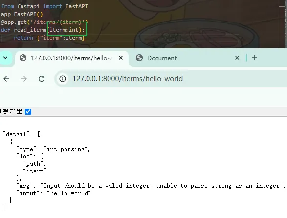

# fastAPI
<!-- header -->
!!! notes 前言
    XXXX

---

## 安装

1. 安装：`pip install fastapi`
2. 阿里云镜像安装：`pip install fastapi -i https://mirrors.aliyun.com/pypi/simple`
3. fastapi 启动依赖 uvicorn，安装 uvicorn：`pip install uvicorn -i https://mirrors.aliyun.com/pypi/simple`

<h6 id="TcwHM">验证安装是否成功</h6>
+ 在安装 `fastapi` 的文件下新建`main.py`文件
+ 终端`uvicorn main:app --reload`命令开启 uvicorn 服务


重启命令之后的终端内容：

```bash
PS D:\MyFile\AllCode\NodeCode\7sevenwenk\restfullapi> uvicorn main:app --reload
INFO:     Will watch for changes in these directories: ['D:\\MyFile\\AllCode\\NodeCode\\7sevenwenk\\restfullapi']
INFO:     Uvicorn running on http://127.0.0.1:8000 (Press CTRL+C to quit)
INFO:     Started reloader process [19936] using StatReload
INFO:     Started server process [21868]
INFO:     Started server process [21868]
INFO:     Waiting for application startup.
INFO:     Application startup complete.
INFO:     127.0.0.1:49791 - "GET / HTTP/1.1" 200 OK
INFO:     127.0.0.1:49791 - "GET /favicon.ico HTTP/1.1" 404 Not Found

```

终端命令运行之后，文件夹生成`__pycache__`，浏览器访问 127.0.0.1:8000，显示内容信息。

终端开启服务命令：

+ `main`：及创建的文件 `main.py`
+ `app`：`FastAPI()=app`，即是实例化对象
+ `--reload`：代码改变重启服务器，只在开发阶段使用

## 程序结构
基础的 fastapi 程序需要五个步骤：

```python
# step1:导入FastAPI
from fastapi import FastAPI
# step2:创建一个app实例
app=FastAPI()
# step3:编写一个路径操作装饰器
# get可以换成
# post/put/delete...
# 路径也可以换成其他的额路径，如
# /hello  /index.html ...
@app.get('/')
# step4:编写一个路径操作函数
# 函数返回值也不是固定
async def root():
    return {'message':'hello world'}
# step5:运行开发服务器（终端进行）
```

终端启动服务器运行的时候，也可以指定服务器地址和端口号：
`uvicorn main:app --host 127.0.0.1 --port 8001 --reload`

<h6 id="uZ7WY">路径操作装饰器中路径参数</h6>

1. 声明路径参数



路径当中输入的 iterm 会作为路径操作函数的参数的值，进而被显示到浏览器上。

2. 声明路径参数的类型

当路径操作函数声明参数类型为 int 时：


当路径操作函数声明参数类型为 str 时：浏览器数据就会正常显示。

实际上，挡在路径操作函数里面定义了参数类型，当访问链接的时候的数据不正确时，fastapi 会进行是数据校验。

+ 所有的数据验证都是由Pydantic实现的
+ 你可以用同样的类型声明比如str、float、bool或者其他更复杂的类型
3. 限定路径参数有效值

```python
from fastapi import FastAPI
from enum import Enum
app=FastAPI()

class my_class_name(str,Enum):
    name='xiaohua',
    age=18,
    id='123456',
    isStudent=True

@app.get('/my/{po}')
def root(po:my_class_name):
    return {'status':po}
```

设定参数的类型是一个 class 对象，在访问的时候，只有当 po 是限定类型中的数据时才会进行正常显示。


4. 路径参数的值是路径类型的变量

路径中的参数是路径，使用 Path 转换器进行转换。

<h6 id="pabE7">查询参数</h6>
1. 查询参数

当生命不属于路径参数的其他函数参数时，该参数将自动解释为“Query”参数，即查询参数。即为在 URL `？`之后的`key-value`键值对，每对键值对使用`&`进行分割。

`http://127.0.0.1:8000/iterms/?skip=0&limit=10`：查询参数有两个，一个是 skip，一个是 limit，因为它们都是 URL 的一部分，它们本质上都是字符串。

```python
from fastapi import FastAPI
app=FastAPI()
# 查询参数
# 输入 http://127.0.0.1:8000/files/?num1=2&num2=8
# http://127.0.0.1:8000/files/?num1=10&num2=20
# 都会将数据输出
@app.get('/files/')
def add(num1:int=2,num2:int=8):
    return {"num1+num2=",num1+num2}
```


当在浏览器输入 `http://127.0.0.1:8000/files/?num1=10&num2=20`进行访问，都会将两数之和给返回到浏览器页面。

当浏览器访问不带上查询参数时，那么就是默认值的情况，`http://127.0.0.1:8000/files/`


因为 query 参数类不是 path 中固定的一部分，故而它们是可选的，且可以有默认值。

2. 设置可选的查询参数

声明可选的 query 参数，将查询参数的 默认值设置为`None`。


<h6 id="idkv4">请求体</h6>
1. 请求体

request body，API 几乎总是必须发送一个响应体，但是客户端并不需要，请求体定义，使用`Pydantic 模型。`

其中：

+ 不能通过 GET 请求发送请求体
+ 发送请求体数据，必须使用：POSST/UT/DELETE/PATCH
2. 实现请求体
+ 从 `Pydantic`中导入`BaseModel`：`from pydantic import BaseModeel`
+ 创建请求体数据模型：声明请求体数据模型为一个类，且类继承 BaseModel。所有的属性都用标准 python 类。同查询参数，当数据类型的属性不是必须的话，可有一个默认值或是可选的 None，否则该属性就是必须的。

```python
# 声明一个json对象：
class Iterm(BaseModel):
    name:str
    description:str=None
    price:float
    tax:float=None
# 访问链接时传入的请求体可以为：
{
    "name":"xiaohua",
    "description":"an optional description,
    "price":12.09,
    "tax":1.2
}v
也可以为：
{
    "name":"xiaohua",
    "price":12.09
}
```

+ 将模型定义为参数

将定义的模型添加到路径操作含糊当中去。

```python
from pydantic import BaseModel
# 创建一个类，该类继承自BaseModel类
class Iterm(BaseModel):
    name:str
    description:str=None
    price:float
    tax:float=None
@app.post('/iterms/')
async def creste_iterm(iterm:Iterm):
    return iterm
```

声明的参数是自己创建的模型 `Iterm`，使用 postman 访问链接并发送请求体过去，将内容进行输出。


<h6 id="pXq3U">给查询参数设置验证条件，用于字符串的验证</h6>
1. 给查询参数添加验证

```python
# 将num设置为查询参数，且 是设置为None，表示该参数可选
@app.get('/iterms')
def read(num:str=None):
    ret={"iterm":"happy day"}
    # 当数据存在，就向字典中添加键值对 "num":num
    if num:
        ret.update({"num":num}) 
    return ret
```

添加验证：即便该参数可选，设置该数值的长度不能超过 50 个字符。此为设置条件。

+ 导入 query：`from fastapi import Query`
+ 使用 query 在路径操作函数的参数位置设置 max_length 验证

`num:str= Query(None， max_length=50)# 可选` 

`num:str= Query(... ， max_length=50)# 必选`

+ 当然，也可以给查询参数声明一些额外的验证和元数据，验证参数：alias、title、description。

<h6 id="p5naH">给路径参数添加验证（数值验证 ）</h6>
1. 给路径参数添加验证
+ 导入路径模块：`from fastapi import Path`/`from fastapi import Query`
+ 使用 Path 声明元数据，声明 Query 中所有的 参数

`iterm_id:int=Path(...,title="the code"),q:str=Query(None,alias="iterm-query")`

+ Path 参数是必须的，它是路径当中的一部分，需要使用....声明标志这是必需参数

```python
from fastapi import FastAPI
from fastapi import Query
from fastapi import Path

app=FastAPI()
@app.get('/iterms/{iterm_id}')
# 路径参数
async def read_items(*, item_id: int = Path(title="Thes"), q: str):
    ret={"iterm_id":iterm_id}
    if q:
        ret.update({"q":q})
    return ret
```